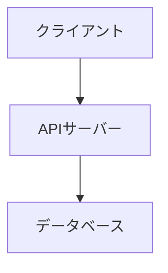
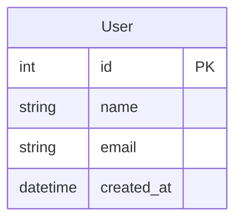
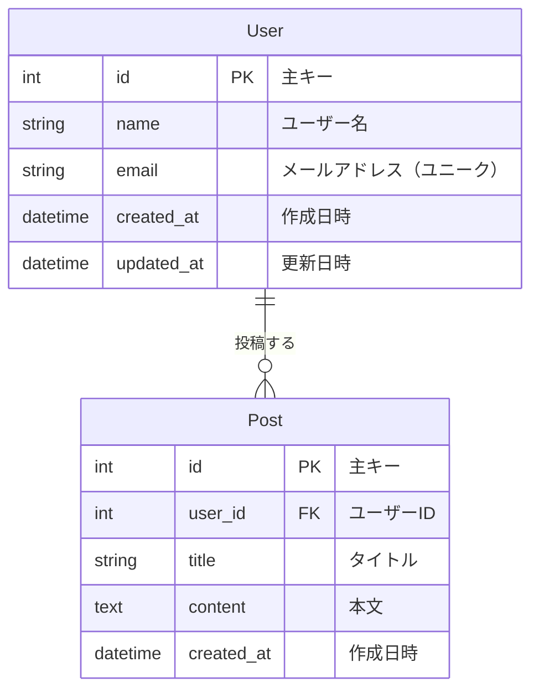
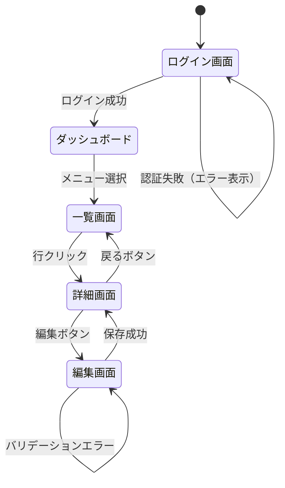

# Dev Planner - ドキュメントテンプレート集

## 全体仕様書（SPEC.md）

`docs/SPEC.md` として保存。改修のたびに「変更履歴」と関連セクションを更新する。

```markdown
# [プロジェクト名] 全体仕様書

最終更新: YYYY-MM-DD

## 概要

### 目的
[このプロジェクトが解決する課題・目的を1〜3文で記述]

### 主要機能
- [機能1]
- [機能2]
- [機能3]

### 技術スタック
- **フロントエンド**: [React/Vue/XAML等]
- **バックエンド**: [Node.js/Python/C#等]
- **データベース**: [PostgreSQL/SQLite等、なければ「なし」]
- **インフラ**: [Docker/AWS等、なければ省略]

---

## アーキテクチャ

### システム構成
[システム全体の構成を説明。必要に応じてMermaid図を使用]



### ディレクトリ構成
```
[プロジェクト名]/
├── src/
│   ├── [主要ディレクトリ]/
│   └── ...
└── ...
```

---

## 機能一覧

| 機能名 | 説明 | 状態 | 実装バージョン |
|-------|-----|------|-------------|
| [機能1] | [説明] | 実装済み | v1.0.0 |
| [機能2] | [説明] | 実装済み | v1.1.0 |

---

## データモデル

[DBがある場合のみ。主要エンティティの定義]



---

## API設計

[REST APIがある場合のみ]

| メソッド | エンドポイント | 説明 | 認証 |
|---------|------------|-----|-----|
| GET | /api/users | ユーザー一覧取得 | 必要 |
| POST | /api/users | ユーザー作成 | 必要 |

---

## 変更履歴

| バージョン | 日付 | 改修名 | 主な変更内容 |
|---------|------|-------|------------|
| v1.0.0 | YYYY-MM-DD | 初期リリース | 初期実装 |

---

## 既知の問題・技術的負債

- [既知の問題があれば記載]

---

## 今後の改善予定

- [将来的な改善案があれば記載]
```

---

## 要件定義書テンプレート

`docs/revisions/NNN_YYYYMMDD_[改修名]/要件定義.md` として保存。

```markdown
# 要件定義書

| 項目 | 内容 |
|-----|-----|
| 改修名 | [改修の短い名称] |
| 作成日 | YYYY-MM-DD |
| 対象バージョン | v[X.Y.Z] |
| 担当 | - |

---

## 改修の背景・目的

[なぜこの改修が必要なのか。解決したい課題や達成したい目標を記述]

---

## 要件一覧

### 機能要件

| No | 要件名 | 詳細 | 優先度 |
|----|-------|-----|-------|
| F-1 | [要件名] | [具体的な内容] | 高/中/低 |
| F-2 | [要件名] | [具体的な内容] | 高/中/低 |

### 非機能要件

| No | 要件名 | 詳細 |
|----|-------|-----|
| N-1 | パフォーマンス | [例: ページ読み込み3秒以内] |
| N-2 | セキュリティ | [例: 認証必須、入力値検証] |

---

## スコープ

### 対象（In Scope）
- [この改修で対応すること]

### 対象外（Out of Scope）
- [この改修では対応しないこと]

---

## 受け入れ条件

- [ ] [条件1: 〜できること]
- [ ] [条件2: 〜が表示されること]
- [ ] [条件3: エラー時に〜を表示すること]

---

## 影響範囲

### 変更予定ファイル
- `[ファイルパス]` - [変更内容]

### 影響を受ける機能
- [影響する既存機能]

---

## 依存関係・前提条件

- [必要な前提条件があれば記載]
- [依存する他のタスク・Issueがあれば記載]
```

---

## DB設計書テンプレート

`docs/revisions/NNN_YYYYMMDD_[改修名]/DB設計.md` として保存。DBありプロジェクトのみ作成。

```markdown
# DB設計書

| 項目 | 内容 |
|-----|-----|
| 改修名 | [改修の短い名称] |
| 作成日 | YYYY-MM-DD |

---

## 変更概要

[今回のDB変更の目的と概要を記述]

---

## ER図（変更後）



---

## テーブル定義

### [テーブル名]

| カラム名 | 型 | NULL | デフォルト | 説明 |
|--------|---|------|---------|-----|
| id | INT | NOT NULL | AUTO_INCREMENT | 主キー |
| name | VARCHAR(100) | NOT NULL | - | 名前 |
| created_at | DATETIME | NOT NULL | CURRENT_TIMESTAMP | 作成日時 |

**インデックス**:
- `PRIMARY KEY (id)`
- `UNIQUE INDEX (email)`

---

## マイグレーション

### 追加するカラム
```sql
ALTER TABLE users ADD COLUMN profile_image_url VARCHAR(500) AFTER email;
```

### 新規テーブル
```sql
CREATE TABLE posts (
    id INT PRIMARY KEY AUTO_INCREMENT,
    user_id INT NOT NULL,
    title VARCHAR(200) NOT NULL,
    content TEXT,
    created_at DATETIME NOT NULL DEFAULT CURRENT_TIMESTAMP,
    FOREIGN KEY (user_id) REFERENCES users(id) ON DELETE CASCADE
);
```

### ロールバック手順
```sql
-- ロールバック時に実行するSQL
DROP TABLE IF EXISTS posts;
ALTER TABLE users DROP COLUMN profile_image_url;
```

---

## 影響分析

| 変更内容 | 影響するコード | 対応方法 |
|--------|-------------|--------|
| postsテーブル追加 | `PostRepository.cs` | 新規作成 |
| usersにカラム追加 | `UserModel.py` | モデル更新 |
```

---

## 画面遷移図テンプレート

`docs/revisions/NNN_YYYYMMDD_[改修名]/画面遷移図.md` として保存。フロントエンドありプロジェクトのみ作成。

```markdown
# 画面遷移図

| 項目 | 内容 |
|-----|-----|
| 改修名 | [改修の短い名称] |
| 作成日 | YYYY-MM-DD |

---

## 変更概要

[今回の画面追加・変更の概要を記述]

---

## 画面遷移図（全体）



---

## 今回追加・変更する画面

### [画面名]（新規/変更）

**URL**: `/[path]`

**目的**: [この画面の役割]

**表示条件**: [どのユーザーが見られるか、どの状態で表示されるか]

**主要コンポーネント**:
- [コンポーネント1]: [役割]
- [コンポーネント2]: [役割]

**遷移先**:
| 操作 | 遷移先 | 条件 |
|-----|-------|-----|
| [ボタン名]クリック | [遷移先画面] | [条件があれば] |
| キャンセル | [前画面] | - |

---

## 画面レイアウト（ワイヤーフレーム）

```
+-----------------------------------+
| ヘッダー           [ユーザー名] ▼ |
+-----------------------------------+
| [サイドメニュー] | メインコンテンツ  |
|                 |                  |
|  ・メニュー1    | [タイトル]        |
|  ・メニュー2    |                  |
|                 | [コンテンツ]      |
|                 |                  |
|                 | [ボタン]         |
+-----------------------------------+
```

---

## 変更前後の比較

### 変更前
[既存の画面遷移・レイアウトの説明]

### 変更後
[新しい画面遷移・レイアウトの説明]

---

## UX考慮事項

- [ユーザビリティ上の配慮事項]
- [エラー状態の表示方法]
- [ローディング状態の扱い]
```
